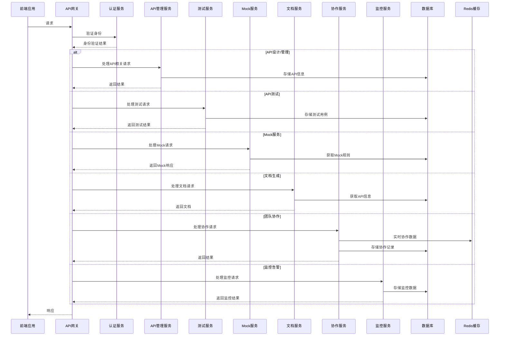

# API工具技术架构设计

## 1. 技术栈选择

### 1.1 后端技术栈

| 技术 | 版本 | 选型理由 |
|------|------|----------|
| Java | 17+ | 成熟稳定，生态丰富，适合企业级应用开发 |
| Spring Boot | 3.2+ | 简化开发，内嵌容器，快速部署 |
| Spring Cloud | 2023.0+ | 微服务架构支持，服务发现和配置管理 |
| Spring Security | 6.2+ | 企业级安全框架，支持OAuth2.0和JWT |
| MyBatis-Plus | 3.5+ | 增强MyBatis，简化CRUD操作 |
| MySQL | 8.0+ | 关系型数据库，稳定可靠，适合结构化数据存储 |
| Redis | 7.0+ | 缓存和会话存储，提升系统性能 |
| RabbitMQ | 3.12+ | 消息队列，解耦系统组件，提高可靠性 |
| WebSocket | - | 实时通信，支持团队协作功能 |
| gRPC | 1.59+ | 高性能RPC框架，支持服务间通信和API测试 |
| Dubbo | 3.2+ | 分布式服务框架，支持Dubbo协议的API测试 |
| Protocol Buffers | 3.20+ | 高效的序列化框架，用于gRPC和数据传输 |

### 1.2 前端技术栈

| 技术 | 版本 | 选型理由 |
|------|------|----------|
| Vue.js | 3.3+ | 轻量级前端框架，响应式数据绑定，组件化开发 |
| TypeScript | 5.0+ | 类型安全，提高代码质量和可维护性 |
| Vite | 4.4+ | 快速的前端构建工具，热更新，优化开发体验 |
| Pinia | 2.1+ | 状态管理库，替代Vuex，更简洁的API |
| Element Plus | 2.3+ | UI组件库，提供丰富的界面元素 |
| Axios | 1.4+ | HTTP客户端，处理API请求 |
| ECharts | 5.4+ | 数据可视化库，用于监控仪表盘 |
| Monaco Editor | 0.38+ | 代码编辑器，用于API测试脚本编辑 |
| Vue Router | 4.2+ | 前端路由管理，支持单页应用 |
| Day.js | 1.11+ | 轻量级日期处理库，替代Moment.js |
| Lodash | 4.17+ | 实用工具库，提供丰富的函数式编程工具 |
| Socket.io-client | 4.7+ | WebSocket客户端，支持实时通信 |

### 1.3 开发工具

| 工具 | 版本 | 用途 |
|------|------|------|
| IntelliJ IDEA | 2023+ | Java后端开发 |
| Visual Studio Code | 1.80+ | 前端开发 |
| Git | 2.40+ | 版本控制 |
| Docker | 20.10+ | 容器化部署 |
| Jenkins | 2.400+ | CI/CD自动化 |

## 2. 系统架构设计

### 2.1 架构风格
采用**前后端分离**的微服务架构，后端提供RESTful API，前端通过HTTP请求与后端交互。

### 2.2 核心架构图



### 2.3 模块划分

| 模块 | 职责 | 技术实现 |
|------|------|----------|
| 认证模块 | 用户登录、注册、权限管理 | Spring Security + JWT |
| API管理模块 | API设计、编辑、分类管理 | Spring Boot + MyBatis-Plus |
| 测试模块 | 请求发送、响应分析、测试用例管理 | Spring Boot + 自定义测试引擎 |
| Mock模块 | Mock数据生成、规则管理 | Spring Boot + 模板引擎 |
| 文档模块 | API文档生成、导出 | Spring Boot + 模板引擎 |
| 协作模块 | 工作区管理、实时协作、版本控制 | Spring Boot + WebSocket + Git |
| 环境模块 | 多环境配置、变量管理 | Spring Boot + Redis |
| 监控模块 | API监控、性能分析、告警 | Spring Boot + Quartz + ECharts |
| 集成模块 | CI/CD集成、第三方工具集成 | Spring Boot + WebHook |

## 3. 前后端分离方案

### 3.1 前端架构

```
前端项目结构：
├── public/              # 静态资源
├── src/
│   ├── assets/          # 图片、样式等资源
│   ├── components/      # 通用组件
│   ├── views/           # 页面视图
│   ├── router/          # 路由配置
│   ├── store/           # 状态管理
│   ├── api/             # API请求封装
│   ├── utils/           # 工具函数
│   ├── services/        # 业务逻辑服务
│   ├── types/           # TypeScript类型定义
│   ├── App.vue          # 根组件
│   └── main.ts          # 入口文件
├── .env                 # 环境变量
├── tsconfig.json        # TypeScript配置
├── vite.config.ts       # Vite配置
└── package.json         # 项目依赖
```

### 3.2 后端架构

```
后端项目结构：
├── api-gateway/         # API网关
├── auth-service/        # 认证服务
├── api-service/         # API管理服务
├── test-service/        # 测试服务
├── mock-service/        # Mock服务
├── doc-service/         # 文档服务
├── collab-service/      # 协作服务
├── monitor-service/     # 监控服务
├── common/              # 公共模块
│   ├── common-core/     # 核心工具类
│   ├── common-security/ # 安全相关
│   └── common-feign/    # 服务间调用
└── config-center/       # 配置中心
```

### 3.3 通信协议

- **API通信**：RESTful HTTP/HTTPS
- **实时通信**：WebSocket
- **服务间通信**：gRPC（内部服务）、Feign（Spring Cloud）

### 3.4 数据传输格式

- **请求/响应**：JSON
- **配置文件**：YAML/Properties
- **API定义**：JSON/YAML（兼容OpenAPI规范）

## 4. 核心模块技术实现

### 4.1 API设计模块

#### 4.1.1 技术实现

- **数据模型**：
  - API信息（路径、方法、描述等）
  - 参数信息（名称、类型、必填等）
  - 请求体信息（格式、结构等）
  - 响应信息（状态码、结构等）

- **核心功能**：
  - 可视化API编辑器（基于Vue组件）
  - API导入/导出（支持OpenAPI 3.0、Swagger 2.0）
  - API分类和标签管理
  - 参数验证规则配置

#### 4.1.2 关键技术点

- **OpenAPI规范支持**：实现OpenAPI 3.0规范的解析和生成
- **可视化编辑器**：使用Vue组件实现拖拽式API设计
- **参数验证**：基于JSON Schema的参数验证规则

### 4.2 API测试模块

#### 4.2.1 技术实现

- **核心功能**：
  - HTTP客户端（基于OkHttp/HttpClient）
  - 测试用例管理（创建、编辑、执行）
  - 响应分析（状态码、响应时间、响应体）
  - 测试脚本（前置脚本、后置脚本）

- **技术要点**：
  - 异步请求处理（支持并发测试）
  - 响应结果缓存（提升性能）
  - 脚本执行引擎（支持JavaScript）

### 4.3 Mock服务模块

#### 4.3.1 技术实现

- **核心功能**：
  - 基于API定义自动生成Mock数据
  - 自定义Mock规则（基于请求参数）
  - Mock服务部署和管理
  - Mock数据模板管理

- **技术要点**：
  - 动态数据生成（基于类型和规则）
  - 规则引擎（支持条件判断）
  - Mock服务高可用（集群部署）

### 4.4 文档生成模块

#### 4.4.1 技术实现

- **核心功能**：
  - 自动生成API文档
  - 支持多格式导出（HTML、Markdown、PDF）
  - 文档版本管理
  - 文档分享和访问控制

- **技术要点**：
  - 模板引擎（Thymeleaf/Freemarker）
  - 文档静态化（提升访问速度）
  - 权限控制（基于Spring Security）

### 4.5 团队协作模块

#### 4.5.1 技术实现

- **核心功能**：
  - 工作区管理（创建、编辑、删除）
  - 成员管理和权限控制
  - 实时协作编辑（基于WebSocket）
  - 版本历史和变更对比

- **技术要点**：
  - WebSocket集群（支持多实例部署）
  - 操作冲突解决（乐观锁）
  - 变更追踪（类似Git的版本管理）

### 4.6 环境管理模块

#### 4.6.1 技术实现

- **核心功能**：
  - 多环境配置（开发、测试、生产）
  - 环境变量管理
  - 环境切换功能
  - 变量继承和覆盖机制

- **技术要点**：
  - 变量解析引擎（支持嵌套变量）
  - 环境隔离（确保数据安全）
  - 变量加密（敏感信息保护）

### 4.7 监控告警模块

#### 4.7.1 技术实现

- **核心功能**：
  - API调用监控
  - 性能分析（响应时间、成功率）
  - 异常告警（邮件、Webhook）
  - 监控仪表盘

- **技术要点**：
  - 分布式追踪（Sleuth + Zipkin）
  - 时序数据库（InfluxDB，存储监控数据）
  - 告警规则引擎（支持复杂条件）

## 5. 数据库设计

### 5.1 核心数据表

#### 5.1.1 用户表（`user`）

| 字段名 | 数据类型 | 约束 | 描述 |
|--------|----------|------|------|
| `id` | `BIGINT` | `PRIMARY KEY AUTO_INCREMENT` | 用户ID |
| `username` | `VARCHAR(50)` | `UNIQUE NOT NULL` | 用户名 |
| `email` | `VARCHAR(100)` | `UNIQUE NOT NULL` | 邮箱 |
| `password` | `VARCHAR(100)` | `NOT NULL` | 密码（加密存储） |
| `nickname` | `VARCHAR(50)` | `NOT NULL` | 昵称 |
| `avatar` | `VARCHAR(255)` | | 头像URL |
| `role` | `VARCHAR(20)` | `NOT NULL DEFAULT 'user'` | 角色（user/admin） |
| `status` | `INT` | `NOT NULL DEFAULT 1` | 状态（1:启用，0:禁用） |
| `created_at` | `DATETIME` | `NOT NULL DEFAULT CURRENT_TIMESTAMP` | 创建时间 |
| `updated_at` | `DATETIME` | `NOT NULL DEFAULT CURRENT_TIMESTAMP ON UPDATE CURRENT_TIMESTAMP` | 更新时间 |

#### 5.1.2 项目表（`project`）

| 字段名 | 数据类型 | 约束 | 描述 |
|--------|----------|------|------|
| `id` | `BIGINT` | `PRIMARY KEY AUTO_INCREMENT` | 项目ID |
| `name` | `VARCHAR(100)` | `NOT NULL` | 项目名称 |
| `description` | `TEXT` | | 项目描述 |
| `owner_id` | `BIGINT` | `NOT NULL REFERENCES user(id)` | 所有者ID |
| `status` | `INT` | `NOT NULL DEFAULT 1` | 状态（1:活跃，0:归档） |
| `created_at` | `DATETIME` | `NOT NULL DEFAULT CURRENT_TIMESTAMP` | 创建时间 |
| `updated_at` | `DATETIME` | `NOT NULL DEFAULT CURRENT_TIMESTAMP ON UPDATE CURRENT_TIMESTAMP` | 更新时间 |

#### 5.1.3 API表（`api`）

| 字段名 | 数据类型 | 约束 | 描述 |
|--------|----------|------|------|
| `id` | `BIGINT` | `PRIMARY KEY AUTO_INCREMENT` | API ID |
| `project_id` | `BIGINT` | `NOT NULL REFERENCES project(id)` | 项目ID |
| `path` | `VARCHAR(255)` | `NOT NULL` | API路径 |
| `method` | `VARCHAR(10)` | `NOT NULL` | HTTP方法 |
| `name` | `VARCHAR(100)` | `NOT NULL` | API名称 |
| `description` | `TEXT` | | API描述 |
| `request_headers` | `JSON` | | 请求头（JSON格式） |
| `request_params` | `JSON` | | 查询参数（JSON格式） |
| `request_body` | `JSON` | | 请求体（JSON格式） |
| `response` | `JSON` | | 响应示例（JSON格式） |
| `status_code` | `INT` | | 状态码 |
| `category_id` | `BIGINT` | `REFERENCES api_category(id)` | 分类ID |
| `created_at` | `DATETIME` | `NOT NULL DEFAULT CURRENT_TIMESTAMP` | 创建时间 |
| `updated_at` | `DATETIME` | `NOT NULL DEFAULT CURRENT_TIMESTAMP ON UPDATE CURRENT_TIMESTAMP` | 更新时间 |

#### 5.1.4 测试用例表（`test_case`）

| 字段名 | 数据类型 | 约束 | 描述 |
|--------|----------|------|------|
| `id` | `BIGINT` | `PRIMARY KEY AUTO_INCREMENT` | 测试用例ID |
| `api_id` | `BIGINT` | `NOT NULL REFERENCES api(id)` | API ID |
| `name` | `VARCHAR(100)` | `NOT NULL` | 测试用例名称 |
| `description` | `TEXT` | | 测试用例描述 |
| `request_data` | `JSON` | `NOT NULL` | 请求数据（JSON格式） |
| `expected_response` | `JSON` | | 期望响应（JSON格式） |
| `pre_script` | `TEXT` | | 前置脚本 |
| `post_script` | `TEXT` | | 后置脚本 |
| `created_at` | `DATETIME` | `NOT NULL DEFAULT CURRENT_TIMESTAMP` | 创建时间 |
| `updated_at` | `DATETIME` | `NOT NULL DEFAULT CURRENT_TIMESTAMP ON UPDATE CURRENT_TIMESTAMP` | 更新时间 |

#### 5.1.5 Mock规则表（`mock_rule`）

| 字段名 | 数据类型 | 约束 | 描述 |
|--------|----------|------|------|
| `id` | `BIGINT` | `PRIMARY KEY AUTO_INCREMENT` | 规则ID |
| `api_id` | `BIGINT` | `NOT NULL REFERENCES api(id)` | API ID |
| `name` | `VARCHAR(100)` | `NOT NULL` | 规则名称 |
| `condition` | `JSON` | | 匹配条件（JSON格式） |
| `response` | `JSON` | `NOT NULL` | Mock响应（JSON格式） |
| `priority` | `INT` | `NOT NULL DEFAULT 0` | 优先级 |
| `created_at` | `DATETIME` | `NOT NULL DEFAULT CURRENT_TIMESTAMP` | 创建时间 |
| `updated_at` | `DATETIME` | `NOT NULL DEFAULT CURRENT_TIMESTAMP ON UPDATE CURRENT_TIMESTAMP` | 更新时间 |

#### 5.1.6 工作区表（`workspace`）

| 字段名 | 数据类型 | 约束 | 描述 |
|--------|----------|------|------|
| `id` | `BIGINT` | `PRIMARY KEY AUTO_INCREMENT` | 工作区ID |
| `name` | `VARCHAR(100)` | `NOT NULL` | 工作区名称 |
| `description` | `TEXT` | | 工作区描述 |
| `owner_id` | `BIGINT` | `NOT NULL REFERENCES user(id)` | 所有者ID |
| `created_at` | `DATETIME` | `NOT NULL DEFAULT CURRENT_TIMESTAMP` | 创建时间 |
| `updated_at` | `DATETIME` | `NOT NULL DEFAULT CURRENT_TIMESTAMP ON UPDATE CURRENT_TIMESTAMP` | 更新时间 |

#### 5.1.7 工作区成员表（`workspace_member`）

| 字段名 | 数据类型 | 约束 | 描述 |
|--------|----------|------|------|
| `id` | `BIGINT` | `PRIMARY KEY AUTO_INCREMENT` | 记录ID |
| `workspace_id` | `BIGINT` | `NOT NULL REFERENCES workspace(id)` | 工作区ID |
| `user_id` | `BIGINT` | `NOT NULL REFERENCES user(id)` | 用户ID |
| `role` | `VARCHAR(20)` | `NOT NULL` | 角色（owner/member/guest） |
| `created_at` | `DATETIME` | `NOT NULL DEFAULT CURRENT_TIMESTAMP` | 创建时间 |

#### 5.1.8 环境表（`environment`）

| 字段名 | 数据类型 | 约束 | 描述 |
|--------|----------|------|------|
| `id` | `BIGINT` | `PRIMARY KEY AUTO_INCREMENT` | 环境ID |
| `project_id` | `BIGINT` | `NOT NULL REFERENCES project(id)` | 项目ID |
| `name` | `VARCHAR(50)` | `NOT NULL` | 环境名称 |
| `base_url` | `VARCHAR(255)` | `NOT NULL` | 基础URL |
| `variables` | `JSON` | | 环境变量（JSON格式） |
| `created_at` | `DATETIME` | `NOT NULL DEFAULT CURRENT_TIMESTAMP` | 创建时间 |
| `updated_at` | `DATETIME` | `NOT NULL DEFAULT CURRENT_TIMESTAMP ON UPDATE CURRENT_TIMESTAMP` | 更新时间 |

### 5.2 数据库索引设计

| 表名 | 索引名 | 索引字段 | 索引类型 | 用途 |
|------|--------|----------|----------|------|
| `user` | `idx_username` | `username` | `UNIQUE` | 加速用户名查询 |
| `user` | `idx_email` | `email` | `UNIQUE` | 加速邮箱查询 |
| `project` | `idx_owner_id` | `owner_id` | `BTREE` | 加速查询用户的项目 |
| `api` | `idx_project_id` | `project_id` | `BTREE` | 加速查询项目的API |
| `api` | `idx_path_method` | `path, method` | `BTREE` | 加速API路径和方法查询 |
| `test_case` | `idx_api_id` | `api_id` | `BTREE` | 加速查询API的测试用例 |
| `mock_rule` | `idx_api_id` | `api_id` | `BTREE` | 加速查询API的Mock规则 |
| `workspace` | `idx_owner_id` | `owner_id` | `BTREE` | 加速查询用户的工作区 |
| `workspace_member` | `idx_workspace_user` | `workspace_id, user_id` | `BTREE` | 加速查询工作区成员 |
| `environment` | `idx_project_id` | `project_id` | `BTREE` | 加速查询项目的环境 |

## 5. 部署架构

### 5.1 开发环境

- **本地开发**：
  - 后端：IntelliJ IDEA + Spring Boot DevTools
  - 前端：VS Code + Vite（热更新）
  - 数据库：本地MySQL/Redis

- **Docker开发环境**：
  - 使用Docker Compose启动完整的开发环境
  - 包含所有服务和依赖

### 5.2 测试环境

- **CI/CD流程**：
  - 代码提交 → Jenkins构建 → 自动化测试 → 部署到测试环境

- **环境配置**：
  - 独立的测试数据库
  - 模拟生产环境的配置
  - 负载均衡和高可用测试

### 5.3 生产环境

#### 5.3.1 云服务部署

- **架构**：
  - API网关（负载均衡）
  - 微服务集群（多实例）
  - 数据库集群（主从复制）
  - Redis集群（高可用）
  - 消息队列集群

- **云服务选择**：
  - 阿里云/腾讯云/AWS
  - 容器服务（Kubernetes）
  - 数据库服务（RDS）
  - 缓存服务（Redis）

#### 5.3.2 私有部署

- **架构**：
  - 单节点或多节点部署
  - 本地数据库
  - 私有网络访问

- **部署方式**：
  - Docker Compose
  - Kubernetes（企业级）
  - 传统部署（物理机/虚拟机）

### 5.4 监控与运维

- **监控系统**：
  - Prometheus + Grafana（系统监控）
  - ELK Stack（日志管理）
  - Spring Boot Actuator（应用监控）

- **告警机制**：
  - 邮件告警
  - 短信告警
  - Webhook集成（企业微信、钉钉等）

- **自动化运维**：
  - 自动扩缩容
  - 健康检查
  - 故障自动恢复

## 6. 安全性设计

### 6.1 认证与授权

- **认证方式**：
  - JWT（无状态认证）
  - OAuth2.0（第三方登录）
  - SSO（单点登录，企业版）

- **授权机制**：
  - 基于角色的访问控制（RBAC）
  - 细粒度权限控制
  - API访问控制

### 6.2 数据安全

- **数据加密**：
  - 传输加密（HTTPS）
  - 存储加密（敏感信息）
  - 密码加密（BCrypt）

- **数据脱敏**：
  - 敏感信息脱敏展示
  - 日志敏感信息过滤

### 6.3 网络安全

- **网络隔离**：
  - 内网服务隔离
  - DMZ区域划分

- **防护措施**：
  - API网关防护
  - 防火墙配置
  - DDoS防护
  - SQL注入防护
  - XSS防护

### 6.4 安全审计

- **审计日志**：
  - 用户操作日志
  - 系统事件日志
  - 安全事件日志

- **合规性**：
  - GDPR合规
  - 等保合规
  - 行业特定合规

## 7. 性能优化策略

### 7.1 前端优化

- **资源优化**：
  - 代码分割，按需加载
  - 懒加载，减少初始加载时间
  - 资源压缩，减小文件体积
  - 图片优化，使用适当的格式和尺寸
  - 字体优化，使用字体子集

- **渲染优化**：
  - 虚拟列表，处理大量数据
  - 防抖和节流，优化用户输入
  - 缓存策略，减少重复请求
  - 组件按需渲染，避免不必要的计算
  - 减少DOM操作，使用虚拟DOM

- **性能监控**：
  - 前端性能指标监控（FCP、LCP、CLS等）
  - 错误监控和上报
  - 用户行为分析

### 7.2 后端优化

- **数据库优化**：
  - 索引优化，合理设计索引
  - 查询优化，避免全表扫描
  - 连接池配置，提高数据库连接效率
  - 批量操作，减少数据库交互次数
  - 读写分离，提高并发能力

- **缓存策略**：
  - Redis缓存，缓存热点数据
  - 本地缓存，减少网络开销
  - 缓存预热，提前加载热点数据
  - 缓存失效策略，避免缓存雪崩

- **并发处理**：
  - 线程池配置，优化线程使用
  - 异步处理，提高系统吞吐量
  - 并行计算，加速处理复杂任务
  - 非阻塞IO，提高IO效率

- **代码优化**：
  - 减少对象创建，避免内存泄漏
  - 使用更高效的算法和数据结构
  - 减少网络传输，使用更紧凑的数据格式
  - 避免重复计算，使用缓存

### 7.3 系统优化

- **负载均衡**：
  - 服务实例负载均衡，分发请求
  - 数据库读写分离，提高并发能力
  - CDN加速，提高静态资源访问速度

- **扩容策略**：
  - 水平扩容，增加实例数量
  - 垂直扩容，提高单实例性能
  - 自动扩缩容，根据负载自动调整

- **降级策略**：
  - 服务降级，保证核心功能可用
  - 熔断机制，避免服务雪崩
  - 限流措施，保护系统不被过载

- **部署优化**：
  - 容器化部署，提高部署效率
  - 微服务架构，提高系统弹性
  - 多环境部署，隔离开发、测试和生产

- **网络优化**：
  - 使用HTTP/2，提高传输效率
  - 启用GZIP压缩，减少传输数据量
  - 优化DNS解析，减少连接时间
  - 使用连接池，减少TCP连接建立开销

## 8. 扩展性设计

### 8.1 功能扩展性

- **插件系统**：
  - 支持第三方插件
  - 自定义功能扩展

- **API扩展**：
  - 开放API
  - Webhook支持
  - 集成能力

### 8.2 架构扩展性

- **微服务架构**：
  - 服务独立部署
  - 服务横向扩展
  - 服务版本管理

- **配置管理**：
  - 集中式配置
  - 动态配置更新
  - 环境差异化配置

### 8.3 技术扩展性

- **技术栈兼容性**：
  - 支持多种数据库
  - 支持多种消息队列
  - 支持多种缓存方案

- **容器化部署**：
  - Docker支持
  - Kubernetes支持
  - 云原生适配

## 9. 开发与测试策略

### 9.1 开发流程

- **敏捷开发**：
  - 迭代开发
  - 持续集成
  - 持续交付

- **代码规范**：
  - Java Code Conventions
  - Vue Style Guide
  - TypeScript Coding Standards

### 9.2 测试策略

- **测试类型**：
  - 单元测试
  - 集成测试
  - 端到端测试
  - 性能测试
  - 安全测试

- **测试工具**：
  - JUnit 5（Java单元测试）
  - Mockito（Java模拟测试）
  - Jest（前端单元测试）
  - Cypress（前端E2E测试）
  - JMeter（性能测试）

### 9.3 质量保证

- **代码审查**：
  - Pull Request流程
  - 代码质量检查
  - 安全扫描

- **质量指标**：
  - 测试覆盖率
  - 代码复杂度
  - 缺陷密度

## 10. 总结

本技术架构设计文档详细描述了API Master的技术实现方案，包括技术栈选择、系统架构、核心模块实现、数据库设计、部署架构、安全性设计、性能优化和扩展性设计等方面。

该架构采用前后端分离的微服务架构，使用Java Spring Boot作为后端技术栈，Vue.js + TypeScript作为前端技术栈，具有以下特点：

1. **模块化设计**：核心功能拆分为独立模块，便于开发和维护
2. **高可用性**：微服务架构，支持多实例部署和负载均衡
3. **高性能**：缓存策略、异步处理、数据库优化等多种性能优化手段
4. **安全性**：企业级安全框架，多层次安全防护
5. **扩展性**：插件系统、API扩展、架构扩展性设计
6. **可维护性**：清晰的代码结构，完善的测试策略，规范的开发流程

该架构设计满足API Master的功能需求和性能要求，为后续的开发和部署提供了清晰的技术指导。